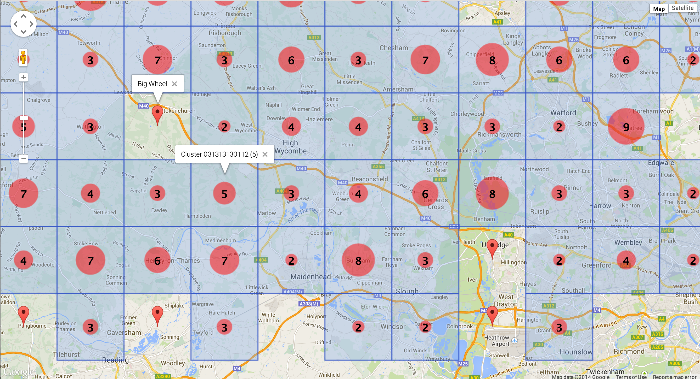

ClusteringServer
================

A simple Play Framework server to demonstrate location clustering with quad keys.

TODO: 
- position the cluster circle based on the "weight" of the tile (where most of the children are located inside the tile) instead of always in the center of the tile
- pre-fetch bigger bounds than the visible screen
- diff the pins/tiles to avoid clearing and redrawing them on the map (flickering)

